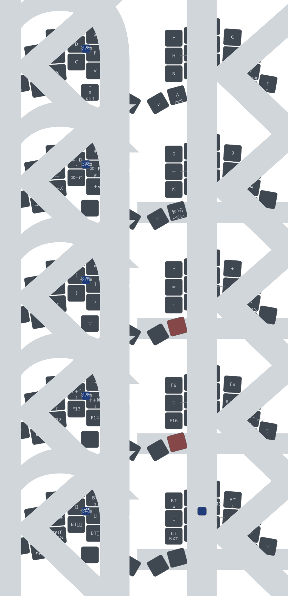

# TOTEM ZMK Configuration

ZMK firmware configuration for the [TOTEM](https://github.com/GEIGEIGEIST/TOTEM) keyboard — a 38-key split column-staggered keyboard powered by Seeed XIAO BLE.

## Keymap

